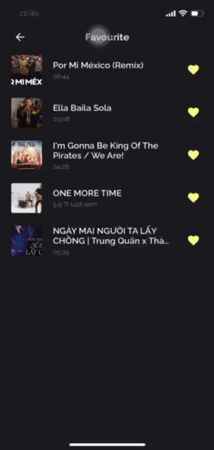

<!-- TABLE OF CONTENTS -->

  
Table of Contents

  <ol>
    <li>
      <a href="#about-the-project">About The Project</a>
    </li>
    <li><a href="#video-demo">Video Demo</a></li>
    <li><a href="#contact">Contact</a></li>
  </ol>

<!-- ABOUT THE PROJECT -->
## About The Project

This is my detail description about MusicApp project when i am working at my company. Because of policy and privacy, i can not attach the code to this repository. If yout want to make some features like this application, please contact me at <a href="#contact">Contact</a>. 

MusicApp can play music both online and offline. Offline music refers to video or audio imported from `Google Drive, Box Drive`,... Online music is sourced from YouTube using `youtube/v1` API and `WKWebView` to obtain the actual MP4 link.
Music APP have some main features:
- Import video and audio from `Google Drive, Box Drive`.
- Search video, audio online and offline.
- Create Playlists.
- Develop layout HomeController.
- Develop PlayerController: 
  - Replay Modes, Random Mode, Rate Media Mode.
  - Next, back video and audio.
  - Rewind or fast-forward media.
  - Convert media offline.
  - Download video Youtube.
  - Like musics.
  - Play musics in background.
  - Setup Remote Commander

Some frameworks and techniques:
- **Realm and FileManager**: : To save, manage and handle data (musics and playlists).
- **AVFoundation**: For playing musics.
- **DispathQueue and DispathGroup**: Fetching Data with multiple Threads.
- **UIview.animate(), CGAffineTransform(), UIPanGestureRecognizer()**: Enhancing user experiences.
- **URLSession**: For fetch RestAPI and download musics.
- **FFmpeg**: For converting music.
- **BoxSD and GGDriveSDK**: For importing musics.
- **WKWebView and Javascript**: Get actual video mp4 link.

(<a href="#readme-top">back to top</a>)

# Video Demo

## I. Import

Main Feature ProfileController

- Import music from `GoogleDrive` and `BoxDrive` :

| Import Google Drive | Import Box Drive |
| :--------: | :--------: | 
|  |  |

## II. HomeController

- In HomeController, i just implement layout and AlbumsDeTailVC.

| Main Home | Albums Detail |
| :--------: | :--------: | 
|  |  | 

# III. PlayerController

- Next, Back ,Rewind and Forward, Random Mode, Download Music.

| Next, Back, Rewind and Forward | Random Mode | Download Music | 
| :--------: | :--------: | :--------: | 
|  |  |  | 

- Convert music, like music and play music in background and control music by remote commander.

| Convert | Likes Music | Remote Commander and PlayBackground |
| :--------: | :--------: | :--------: |
|  |  |  |

## III. Search Controller

- Searching with pure music, filter music, video and music local.

| Search and Load More | Filter Music | 
| :--------: | :--------: | 
|  |  | 

## Contact

Full Name - [Trinh Tien Viet](https://www.facebook.com/mdgarp49) - tienviet153153@gmail.com

(<a href="#readme-top">back to top</a>)

